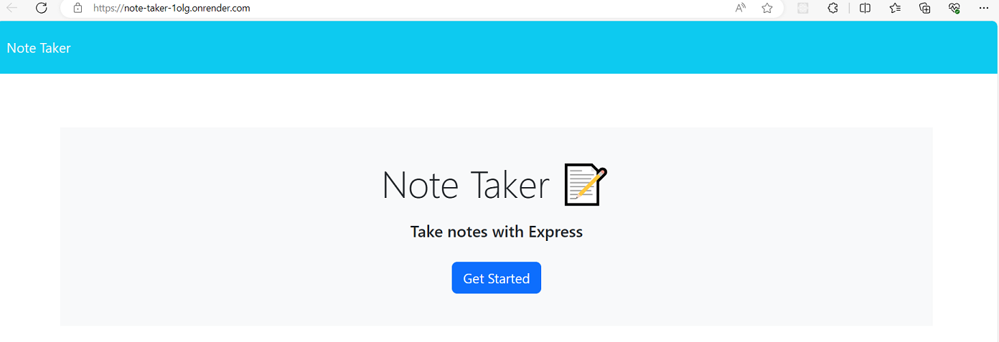
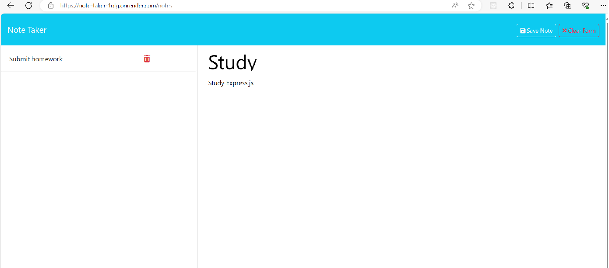

# Description

An Express.js application designed for writing and saving notes.

## Instalation

```sh
npm install
```

## Usage

Visit tha application [web site](https://note-taker-1olg.onrender.com).

On the main page, click the "Get Started" button to navigate to the notes page.



On the notes page, a list of your notes is displayed on the left panel. Clicking on a note will display it in the main panel. To delete a note, press the delete button next to it. You can also create new notes directly in the main panel.


